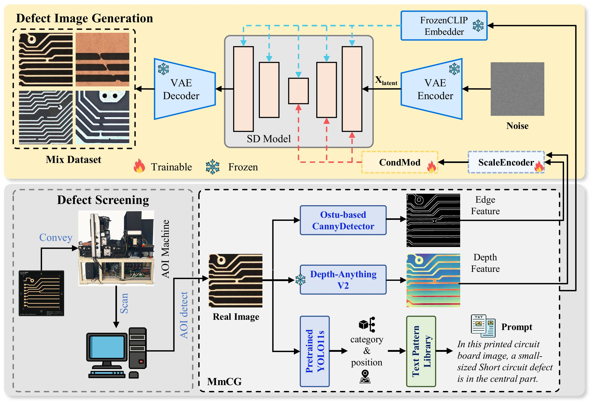
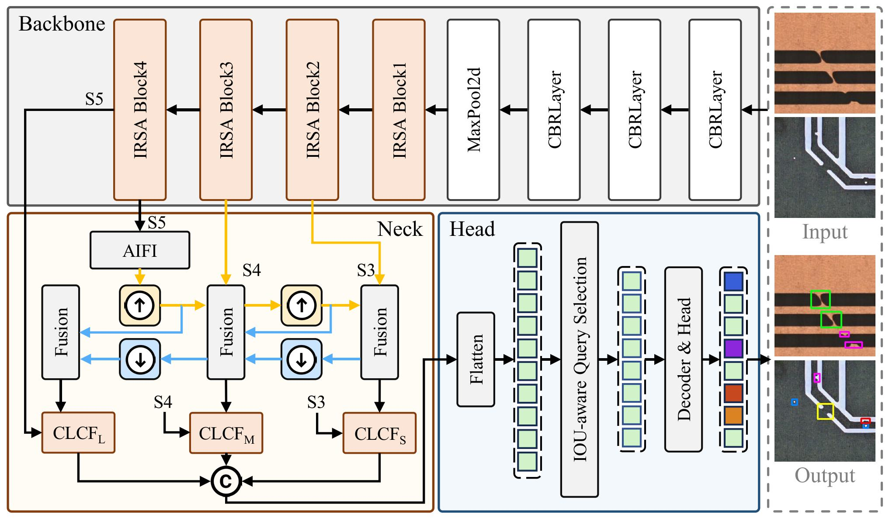

## ⚙️ UniPCB: Unifying Generation and Detection for PCB Defect Inspection

[](https://arxiv.org/abs/2605.04635)
[](LICENSE)
[](https://www.python.org/)
[](https://pytorch.org/)


</div>

---

This is the official PyTorch codes for the paper:

>**UniPCB: Unifying Generation and Detection for PCB Defect Inspection**<br>  [Huan Zhang<sup>1</sup>](), [Lianghong Tan<sup>1</sup>](), [Yichu Xu<sup>2</sup>](), [Jiangzhong Cao<sup>1</sup>](), [Huanqi Wu<sup>1</sup>](), [Linwei Zhu<sup>3</sup>](), [Xu Zhang<sup>1</sup>]()<br>
> <sup>1</sup>Guangdong University of Technology, <sup>2</sup>Wuhan University, <sup>3</sup>Shenzhen Institutes of Advanced Technology, Chinese Academy of Sciences




## 📖 Overview

**UniPCB** is a **generation-assisted PCB defect inspection framework** that unifies multimodal controllable defect synthesis with feature-enhanced detection, jointly alleviating data scarcity and insufficient representation within a single model, combining conditional image generation (`PCB_control`) and defect detection (`PCB_detect`).

## ✨ Highlights

- **UniPCB**: A generation-assisted PCB defect inspection pipeline to systematically enhance inspection performance.
- **Multi-modal Controlled Defect Synthesis**: A latent diffusion architecture with multi-scale embedding and conditional modulation to improve sample fidelity and diversity.
- **Feature-Enhanced Defect Detection**: Effectively capture both global contextual dependencies and fine-grained local textures.

## PCB_control

### Training

1. **Download Pretrained Weights**  
   Download the pretrained Stable Diffusion weights (`v1-5-pruned.ckpt`) and place it in `PCB_control/ckpt/`.

2. **Prepare Initialization Weights**  
   Run the following command to generate initial weights for training:
   ```bash
   python utils/prepare_weights.py init_local \
       ckpt/v1-5-pruned.ckpt \
       configs/local_v15.yaml \
       ckpt/init_local.ckpt

Arguments: mode, pretrained SD weights, config file, output path.

To prepare the training data, please ensure that they are placed in the ./data/ folder and organized in the following manner:

data/

├── anno.txt

├── images/

├── conditions/

    ├── condition-1/
    
    ├── condition-2/
    
    ...
    
...

Specifically, you have to put the original images into PCB\_control/data/images/ folder and the extracted conditions into Pcb\_control/data/conditions/condition-N/ folder. And PCB\_control/data/anno.txt is the annotation file, where each line represents a training sample and is divided into two parts: 1) file ID and 2) annotation. Please ensure the consistency between the file IDs in ./data/anno.txt， ./data/images/ and ./data/conditions/condition-N/ directories.

Now, you can train with you own data simply by:

python src/train/train.py

Kindly note that the local adapter and global adapter must be trained separately. Additionally, you can customize the training configurations in PCB\_control/src/train/train.py and PCB\_control/configs/.


## PCB\_detect

📌 Usage Instructions (Training \& Validation)

This repository provides the Python/PyTorch implementation of my customized modules and model variants based on the Ultralytics YOLO framework.
All training, validation, and inference workflows follow the official Ultralytics documentation.

🚀 Training \& Validation

Since this project is built on top of Ultralytics, users can directly follow the official guides:

Ultralytics Documentation: https://docs.ultralytics.com

Training Guide: https://docs.ultralytics.com/modes/train/

Trainning Example: yolo task=detect mode=train model="path/to/rtdetr-IRSA-CAMF.yaml" data="path/to/dataset.yaml" device=0,1 pretrained=False imgsz=512

Inference Guide: https://docs.ultralytics.com/modes/predict/

Inference Example: yolo predict imgsz=512 model="path/to/rtdetr\_irsa\_camf.pt" source="path/to/images/" device=1

📁 Model Configuration

The custom model configuration files are located in:

PCB\_detect/ultralytics/cfg/models/rt-detr

Simply reference the corresponding YAML file during training.

